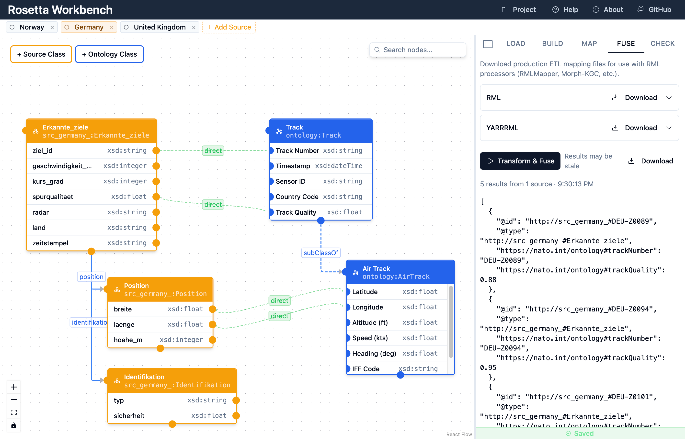

# Rosetta — Visual Ontology Mapper

> A browser-based visual editor for OWL/RDF ontologies and heterogeneous schema mappings.
> Built for defense interoperability scenarios — no backend required.

**[Live Demo →](https://rosetta.drewnollsch.com/)**



---

## What it does

Rosetta lets you visually design the data integration pipeline for coalition operations where allied nations contribute sensor data from different systems — each with its own JSON/XML schema, field names, units, and language. The Semantic Web approach: define a common OWL ontology, map heterogeneous sources to it, validate with SHACL, and transform/fuse into a unified dataset.

All processing runs in the browser. Nothing is sent to a server.

## Features

- **Visual OWL/RDFS ontology editor** — drag-and-drop class nodes, object/data property edges, bidirectional Turtle code editor ↔ canvas sync
- **Multi-source JSON/XML import** — auto-generates RDFS schemas from raw data; each source gets its own canvas layer
- **Visual mapping editor** — drag mapping edges between source and master nodes; supports `direct`, `template`, `constant`, `typecast`, `language`, `formula`, and `sparql` mapping kinds
- **SHACL validation** — author shapes in a Turtle editor, run validation, see per-violation details with node navigation
- **RML/YARRRML export** — download production-ready mapping files for use in ETL pipelines (RMLmapper, Carml, etc.)
- **Transform & Fuse** — execute all mappings via RMLmapper-js, merge into a single RDF graph, export as JSON-LD
- **IndexedDB persistence** — auto-saves your project; export/import as `.onto-mapper.json`
- **Interactive onboarding tour** — guided walkthrough for first-time users
- **Sample project** — NATO air defense radar integration (three nations, three schemas, one ontology)

## Tech Stack

| Layer       | Library                                                             |
| ----------- | ------------------------------------------------------------------- |
| UI          | React 19, TypeScript, Vite, Tailwind CSS 4, shadcn/ui               |
| Canvas      | @xyflow/react (React Flow) v12                                      |
| RDF         | N3.js (parse/serialize), jsonld (JSON-LD), Comunica                 |
| Validation  | rdf-validate-shacl                                                  |
| Transform   | @comake/rmlmapper-js                                                |
| Editors     | CodeMirror 6 (Turtle, JSON)                                         |
| Persistence | idb-keyval (IndexedDB)                                              |

## Running locally

```bash
git clone https://github.com/drex04/rosetta.git
cd rosetta
npm install
npm run dev
```

Open [http://localhost:5173](http://localhost:5173).

## Building for production

```bash
npm run build      # outputs to dist/
npm run preview    # serve the dist/ folder locally
```

The output is a fully static bundle — deploy to GitHub Pages, Netlify, Vercel,
or any static host.

## Background

This project is a learning tool for exploring Semantic Web technologies (OWL,
RDF, SHACL, RML) in the context of a realistic NATO defense interoperability
scenario. It was built to demonstrate that the full Linked Data pipeline —
from raw heterogeneous schemas to a fused, validated RDF graph — can run
entirely client-side.

## License

MIT
